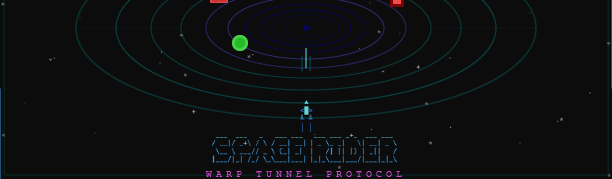

# CMD Space Rider

A retro DOS-style terminal space tunnel game. Pilot your ship through an endless neon warp tunnel, dodge obstacles, collect energy orbs, and chase the high score &mdash; right in your command line or browser.

`Ctrl + click` to play [game](https://isocialpractice.github.io/cmd-space-rider/) in the browser.

## Features

- **DOS terminal graphics** &mdash; Pseudo-3D tunnel rendered with Unicode block elements, box-drawing characters, and 256-color ANSI palette. No graphical window required.
- **Browser preview** &mdash; Open `index.html` in any browser to play the same game rendered as a canvas-based terminal emulator. No build step, no server, no dependencies.
- **Cross-platform** &mdash; Runs on Windows, macOS, and Linux. Any terminal that supports 256 colors and Unicode.
- **Neon warp tunnel** &mdash; Fly through a perspective-scrolling tunnel with pulsing neon walls, animated ring stripes, and a parallax starfield.
- **Ship controls** &mdash; Steer, boost, and fire a pulse cannon.
- **Obstacles and mines** &mdash; Dodge rotating obstacle blocks and blinking mines that deal shield damage on contact.
- **Energy orbs** &mdash; Collect glowing orbs to gain score and restore shield.
- **Progressive difficulty** &mdash; Speed gradually increases with distance. Obstacle density grows every minute. Mines begin spawning after the first minute and escalate over time.
- **HUD** &mdash; Live score, distance traveled, shield percentage, shield bar, and a speed readout showing the current multiple of the starting speed.
- **High score persistence** &mdash; The browser version saves your best score and restores it on load. A `[ NEW BEST ]` banner flashes the moment a run passes it.
- **Pause** &mdash; Press `P` to halt a run and show a `[ PAUSED ]` overlay. The world freezes with it, so once an in-flight flash or shake has finished, the pulsing overlay label is all that still moves. Useful in the browser, where there is no terminal interrupt.
- **Screen shake** &mdash; Taking damage jolts the view for a fraction of a second. The browser build offsets the whole canvas; the terminal build jolts only the play area, leaving the HUD and border anchored.
- **Barrel roll** &mdash; `Q` and `E` roll the ship for half a second. The wings turn through the roll and the hull goes white, and nothing can touch the ship while it does. A cooldown keeps it an escape rather than a way of life.
- **Combo scoring** &mdash; Kills strung together inside two seconds chain: the second is worth double, the third triple, and a `COMBO x3` counter reads the multiplier back on the HUD. Two quiet seconds drop it.
- **Retro sound** &mdash; The browser version synthesizes every tone on the spot with the Web Audio API. No audio files, nothing to load: a pulse cannon zap, an orb chime, a damage crunch, a mine explosion, and an engine hum that pitches up with the boost.
- **CRT overlay** &mdash; The browser version lays scanlines and a soft vignette over the canvas. On out of the box, toggled with `C`, and the choice is remembered across reloads.
- **Debug mode** &mdash; Five test scenarios accessible via CLI flag or URL parameter for isolated gameplay testing.

## Getting Started

### Play in Browser (no install)

Open `index.html` in any modern browser. That's it.

URL parameters for debug modes:

```
index.html?debug                   Open the debug scenario menu
index.html?mode=chaos              Start a specific debug mode directly
index.html?mode=mines              Mine Field mode
index.html?mode=orbs               Orb Harvest mode
index.html?mode=obstacleCollision  Collision Course mode
index.html?mode=mineCollision      Mine Sweeper mode
```

### Play in Terminal

#### Prerequisites

- [Node.js](https://nodejs.org/) v16 or later

#### Install from source

```bash
git clone <repository-url>
cd cmd-space-rider
npm install
npm run build
```

#### Run the game

```bash
npm start
```

Or directly:

```bash
node out/index.js
```

## Usage (CLI)

```
space-rider                          Start in normal mode
space-rider --debug                  Open the debug scenario menu
space-rider --mode <mode>            Start a specific debug mode directly
space-rider --help                   Show help
```

### Controls

| Input | Action |
|---|---|
| `W` / `A` / `S` / `D` or Arrow keys | Steer ship |
| `F` or `Shift` (browser) | Boost |
| `Space` | Fire pulse cannon |
| `Q` / `E` | Barrel roll |
| `P` | Pause / resume a run |
| `M` | Mute toggle |
| `C` (browser) | CRT scanline overlay on / off |
| `Enter` | Launch / relaunch |
| `Esc` | Return to menu / quit |
| `Ctrl+C` | Quit immediately (terminal) |

`M` silences the browser version and shows a `MUTED` indicator in the footer. The
terminal version has no audio, so there the flag only raises the indicator.

### Gameplay

- **Dodge obstacles** &mdash; Red rotating blocks deal 25 shield damage.
- **Avoid mines** &mdash; Blinking red cubes deal 35 shield damage. They take 5 pulse hits to destroy.
- **Collect energy orbs** &mdash; Green glowing orbs restore 10 shield and award 500 points.
- **Destroy targets** &mdash; Shooting obstacles awards 200 points; destroying mines awards 500 points.
- **Chain your kills** &mdash; A second kill within two seconds doubles what it pays, a third triples it, and so on. The multiplier shows as `COMBO x3` on the HUD and resets after two quiet seconds. Orbs are a pickup rather than a kill and never chain.
- **Roll out of trouble** &mdash; `Q` or `E` rolls the ship for half a second, and nothing can hit it mid-roll. The cooldown runs from the start of the roll, so there is a beat of level flight before the next one.
- **Survive** &mdash; The game ends when shield reaches 0.
- **Chase your best** &mdash; Only normal runs count toward the best score. Debug scenarios are diagnostics and never record one.

### Debug Modes

Access via `--debug` (CLI) or `?debug` (browser):

| # | Mode | CLI flag / URL param | Description |
|---|---|---|---|
| 1 | **Mine Field** | `mines` | Only mines. Pure evasion. |
| 2 | **Orb Harvest** | `orbs` | Only orbs. Collect them all. |
| 3 | **Collision Course** | `obstacleCollision` | Hit obstacles. Track every impact. |
| 4 | **Mine Sweeper** | `mineCollision` | Ram mines. Log collisions. |
| 5 | **Chaos Protocol** | `chaos` | Everything at once with permanent boost and auto-fire. |

Navigate the debug menu with arrow keys or number keys, then press `Enter` to launch.

## Project Structure

```
cmd-space-rider/
  index.html        # Browser version (canvas terminal emulator, zero dependencies)
  src/
    index.ts        # CLI entry point, terminal setup, main loop
    input.ts        # Key tables, raw stdin decoding, and key decay windows
    game.ts         # Game engine: state, physics, collision, entity management
    render.ts       # Terminal renderer: tunnel, ship, entities, HUD, effects
    menu.ts         # Menu screens: title, debug menu, game over
    screen.ts       # Double-buffered ANSI screen buffer
    types.ts        # Type definitions, shared constants, color constants
  test/
    helpers.mjs                 # Shared test rigging
    browser-engine.test.mjs     # Browser build behaviour
    terminal-engine.test.mjs    # Terminal build behaviour
    input.test.mjs              # Terminal input decoding and key repeat
    menu-layout.test.mjs        # Menu screens fit every supported size
    barrel-roll.test.mjs        # Roll timing, invincibility, and cooldown
    combo.test.mjs              # Combo chaining, decay, and the HUD counter
    sound.test.mjs              # Sound cues and the browser synthesizer
    hud-row.test.mjs            # The HUD row the counter, label and banner share
    parity.test.mjs             # Both builds agree
  hero.png          # Hero banner graphic
  icon.png          # App icon graphic
  package.json      # CLI tool manifest and dependencies
  tsconfig.json     # TypeScript configuration
```

## Development

```bash
npm run build      # Compile TypeScript to out/
npm run start      # Run the compiled game
npm run dev        # Build and run in one step
npm run debug      # Build and run in debug mode
npm run watch      # Watch mode for development
npm test           # Build, then run the test suite
```

### Tests

The suite uses the Node built-in test runner and adds no dependencies. It covers
both builds and the agreement between them.

The terminal tests import the compiled output from `out/`, which is why `npm test`
builds first. The browser build is a single self-contained `index.html` with no
module boundary to import, so those tests read the file and evaluate its inline
script up to the point where it starts touching the DOM. Everything above that
line is game logic and rendering, which is what gets exercised.

## Terminal Requirements

- **Minimum size**: 60 columns x 20 rows &mdash; the menu screens fit themselves to the height available, giving up spacing and then the per-mode descriptions rather than dropping a line off the bottom.
- **Color support**: 256-color ANSI (most modern terminals)
- **Unicode support**: Box-drawing and block element characters
- **Recommended terminals**: Windows Terminal, iTerm2, GNOME Terminal, Alacritty, Kitty

## How It Works

### Terminal Version

The game uses a custom double-buffered screen renderer built on raw ANSI escape codes. Each frame, the screen buffer is populated with characters and colors, then flushed to stdout as a single optimized write. Input is handled via Node.js raw stdin mode. Terminals only provide key-press events, not key-release, so a key counts as held until its characters stop arriving, and the decay window is checked once per frame. Keys that act on the press rather than the hold get a longer window than the movement keys, so that the first character of an OS auto-repeat is not read as a second press.

### Browser Version

The browser version (`index.html`) is a self-contained HTML file that faithfully reproduces the terminal game as a canvas-based character grid. Each character cell is drawn to an HTML5 Canvas using a monospace font, matching the exact same rendering pipeline: screen buffer, perspective projection, tunnel drawing, entity rendering, HUD, and menus. The grid dimensions adapt dynamically to the browser window size, and keyboard input maps directly to the same control scheme. All game logic &mdash; collision detection, entity spawning, difficulty scaling, scoring, and debug modes &mdash; is identical to the CLI version.

Four things differ, each because the medium allows or demands it. High score persistence uses `localStorage`, which the terminal has no equivalent for, so the CLI version keeps a best score for the session only. The damage screen shake offsets the canvas by a few pixels in the browser, while the terminal has no subpixel positioning and jolts the play area by a whole character column instead. Sound is synthesized with the Web Audio API: the engine names the events either way, queueing a cue for the frame it has just simulated, and only the browser turns those names into tones. The CRT overlay is CSS laid over the canvas rather than anything drawn into the character grid, so `C` toggles it in the browser and it does not exist in the terminal.
